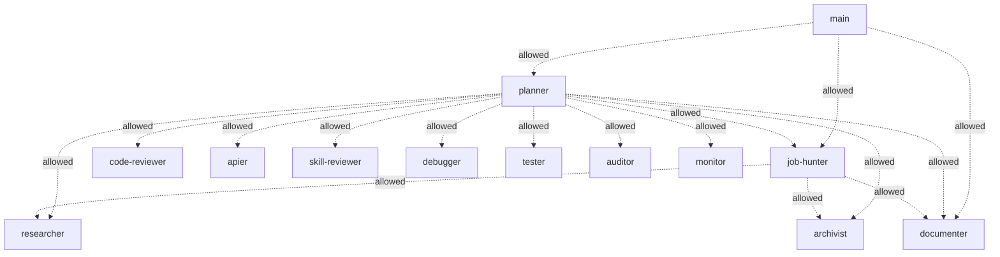

# 🤖 Agentes JARVIS

> Mapa del equipo multi-agente. Actualizado automáticamente por `hermes/orgchart.py` cada 30 min.

## Tabla

| Agente | Rol | Modelo | allowAgents | Children runtime |
|---|---|---|---|---|
| [[main]] | main | `anthropic/claude-sonnet-4-6` | planner, documenter, job-hunter | — |
| [[planner]] | orchestrator | `anthropic/claude-sonnet-4-6` | code-reviewer, researcher, documenter, apier, skill-reviewer, debugger, tester, auditor, archivist, monitor, job-hunter | — |
| [[code-reviewer]] | worker | `anthropic/claude-sonnet-4-6` | — | — |
| [[researcher]] | worker | `anthropic/claude-sonnet-4-6` | — | — |
| [[documenter]] | worker | `anthropic/claude-sonnet-4-6` | — | — |
| [[apier]] | worker | `anthropic/claude-sonnet-4-6` | — | — |
| [[skill-reviewer]] | worker | `anthropic/claude-sonnet-4-6` | — | — |
| [[debugger]] | worker | `anthropic/claude-sonnet-4-6` | — | — |
| [[tester]] | worker | `anthropic/claude-sonnet-4-6` | — | — |
| [[auditor]] | worker | `anthropic/claude-sonnet-4-6` | — | — |
| [[archivist]] | worker | `anthropic/claude-sonnet-4-6` | — | — |
| [[monitor]] | worker | `anthropic/claude-sonnet-4-6` | — | — |
| [[designer]] | worker | `anthropic/claude-sonnet-4-6` | — | — |
| [[job-hunter]] | orchestrator | `anthropic/claude-sonnet-4-6` | researcher, documenter, archivist | — |

## Org chart (Mermaid)

Leyenda:
- `..>` línea punteada: target permitido en config (`allowAgents`).
- `==>` línea sólida: spawn real registrado en subagent-registry.
