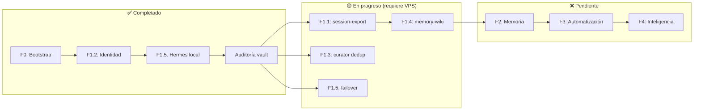
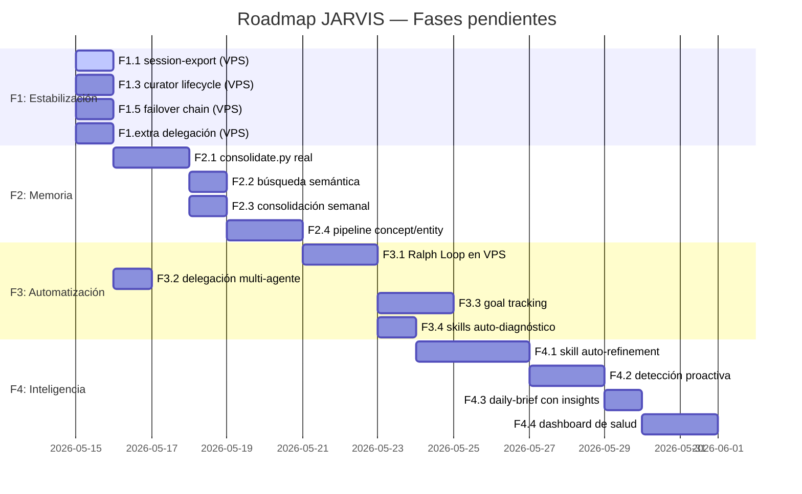

# 🗺️ Guía de Fases Pendientes — Roadmap JARVIS

> Estado a 2026-05-14. Esta guía consolida todo lo que falta por hacer, en qué orden, qué herramienta usar para cada cosa, y qué resultado esperar. Diseñada para que cualquier agente (Antigravity, Claude Code, o el propio JARVIS vía OpenClaw) pueda retomarla y continuar.

---

## Estado actual del sistema



---

## 🔴 FASE 1: Estabilización — Lo que falta (VPS)

> **Requisito:** Conexión SSH al VPS (`ssh agent@88.198.168.61`).
> **Objetivo:** Que todos los cron jobs funcionen y la infraestructura base sea fiable.
> **Tiempo estimado total:** 2-3 horas.

### F1.1 — Reparar session-export

**Por qué importa:** Sin sesiones exportadas, no hay materia prima para la consolidación de memoria, la wiki, ni los resúmenes. Es el cuello de botella número 1 de todo el sistema.

**Pasos:**

1. Ver los logs del cron de session-export dentro del contenedor:
   ```bash
   docker exec -it openclaw-fork-openclaw-gateway-1 openclaw cron logs session-export
   ```
2. Si el comando `cron logs` no existe en tu versión, busca los logs directamente:
   ```bash
   docker logs openclaw-fork-openclaw-gateway-1 2>&1 | grep -i "session-export"
   ```
3. Verificar si OpenClaw detecta sesiones cerradas:
   ```bash
   docker exec -it openclaw-fork-openclaw-gateway-1 openclaw sessions list
   ```
4. Si retorna 0 sesiones, el problema puede ser:
   - Las sesiones de Telegram no se marcan como "cerradas" (requiere configurar el threshold de inactividad).
   - El plugin `session-export` no está habilitado.
   - Revisar en `~/.openclaw/openclaw.json` la sección de plugins/cron para `session-export`.
5. Probar manualmente una exportación forzada y verificar que aparece un archivo en `~/agent-stack/vault/02-sessions/`.

**Criterio de éxito:** Al menos 1 sesión aparece en `02-sessions/` tras una interacción con JARVIS.

**Herramienta recomendada:** Claude Code (conectado al VPS vía terminal, puede leer logs y editar configs directamente).

---

### F1.3 — Restaurar lógica completa del curator

**Por qué importa:** El `curator.py` fue reescrito durante esta sesión. Ahora tiene deduplicación y refinamiento, pero **perdió** la lógica original de marcar skills como `stale` (>30 días sin uso) y `archive` (>90 días), y de regenerar `SKILL_INDEX.md`.

**Pasos:**

1. Recuperar la lógica anterior del curator desde el backup:
   ```bash
   # Ver los backups disponibles del config
   ls -la ~/agent-stack/backups/
   # El curator original podría estar en un backup reciente
   ```
2. Si no hay backup del script, reconstruir la lógica de lifecycle añadiendo al `curator.py` actual:
   - Marcar skills como `stale` si `last_activity_at` > 30 días.
   - Marcar skills como `archive` si `last_activity_at` > 90 días.
   - Regenerar `~/.openclaw/skills/SKILL_INDEX.md` con el catálogo actualizado.
3. Probar el curator manualmente:
   ```bash
   python3 ~/.openclaw/scripts/curator.py
   ```

**Criterio de éxito:** El curator ejecuta sin errores, no genera logs duplicados, y `SKILL_INDEX.md` se regenera.

**Herramienta recomendada:** Claude Code (tiene contexto masivo para ver el script completo y refactorizarlo).

---

### F1.5 — Verificar failover chain

**Por qué importa:** Si Claude Max alcanza su rate limit, JARVIS debe poder seguir operando con Ollama local.

**Pasos:**

1. Verificar la configuración de failover en `openclaw.json`:
   ```bash
   cat ~/.openclaw/openclaw.json | python3 -m json.tool | grep -A 20 "model"
   ```
2. Probar que Ollama responde:
   ```bash
   docker exec -it openclaw-fork-ollama-1 ollama run qwen2.5-coder:7b-instruct "Hola, responde con una sola palabra"
   ```
3. Provocar un fallback (opcional, solo si te atreves): enviar muchas peticiones rápidas hasta que Anthropic devuelva 429, y verificar en los logs que OpenClaw rota automáticamente a Ollama.

**Criterio de éxito:** Ollama responde correctamente y los logs muestran que el failover está configurado.

---

### F1.extra — Aplicar cambios de delegación en OpenClaw

**Por qué importa:** En la auditoría descubrimos que `main` no podía delegar al `planner`, y que `apier` y `skill-reviewer` eran inaccesibles. Corregimos el vault (la documentación), pero **OpenClaw lee su propia config**, no el vault.

**Pasos:**

1. Editar la configuración de agentes en el VPS:
   ```bash
   nano ~/.openclaw/openclaw.json
   ```
2. Buscar la definición del agente `main` y añadir:
   ```json
   "allowAgents": ["planner"]
   ```
3. Buscar la definición del agente `planner` y cambiar a:
   ```json
   "allowAgents": ["code-reviewer", "researcher", "documenter", "apier", "skill-reviewer"]
   ```
4. Reiniciar el gateway:
   ```bash
   docker restart openclaw-fork-openclaw-gateway-1
   ```

**Criterio de éxito:** El planner puede delegar tareas a cualquier worker.

---

## 🟡 FASE 2: Memoria y Contexto

> **Requisito:** F1.1 completada (session-export funcionando).
> **Objetivo:** Que JARVIS recuerde lo que aprende entre sesiones.
> **Tiempo estimado total:** 6-8 horas.

### F2.1 — Hacer funcional el consolidate.py

**Estado actual:** El script existe en el VPS (`~/.openclaw/scripts/consolidate.py`) y tiene un cron a las 04:30, pero la función `extract_facts()` devuelve datos hardcodeados. No extrae hechos reales.

**Pasos:**

1. Modificar `extract_facts()` para que use la CLI de Claude o Ollama para procesar los briefs:
   ```python
   import subprocess
   
   def extract_facts(content):
       prompt = f"""Extrae los hechos clave de este brief en formato JSON.
       Cada hecho debe tener: fact, old_val, new_val, source.
       Solo incluye hechos que representen cambios o decisiones.
       Brief: {content}"""
       
       result = subprocess.run(
           ["ollama", "run", "qwen2.5-coder:7b-instruct", prompt],
           capture_output=True, text=True
       )
       # Parsear JSON del output...
   ```
2. Probar manualmente con un brief real.
3. Monitorear el log durante 3 días: `tail -f ~/.openclaw/scripts/consolidate.log`

**Criterio de éxito:** `memories/temporal-log.md` crece automáticamente con hechos reales.

---

### F2.2 — Búsqueda semántica sobre el vault

**Por qué importa:** Permite que JARVIS busque por significado, no solo por texto literal.

**Pasos:**

1. Verificar que `nomic-embed-text` está disponible en Ollama:
   ```bash
   docker exec -it openclaw-fork-ollama-1 ollama list
   ```
2. Si no aparece, instalarlo:
   ```bash
   docker exec -it openclaw-fork-ollama-1 ollama pull nomic-embed-text
   ```
3. Configurar `memory-core` en `openclaw.json` para que indexe el vault.
4. Probar: preguntarle a JARVIS vía Telegram algo que solo esté en una nota antigua del vault.

**Criterio de éxito:** `memory search "algo del vault"` retorna resultados relevantes.

---

### F2.3 — Consolidación semanal automática

**Pasos:**

1. Crear un template de síntesis semanal en `templates/weekly-synthesis.md`.
2. Crear un cron que cada lunes genere un resumen de la semana en `memories/`.
3. Usar el LLM para analizar todos los briefs + decisions de la semana y generar patrones.

**Criterio de éxito:** Cada lunes aparece una síntesis semanal en `memories/`.

---

### F2.4 — Pipeline concept → entity → synthesis

**Por qué importa:** Es la materialización de la "wiki inteligente" — el vault se auto-enriquece con conocimiento estructurado.

**Pasos:**

1. Definir reglas de extracción: ¿qué es un "concepto"? (tecnología, patrón, decisión). ¿Qué es una "entidad"? (persona, servicio, herramienta).
2. Crear un script que lea las sesiones y decisiones del día y genere notas atómicas en `wiki/concepts/` y `wiki/entities/`.
3. Implementar un paso de "síntesis" que cruza conceptos y entidades relacionados.

**Criterio de éxito:** `wiki/concepts/` y `wiki/entities/` tienen al menos 5 entradas auto-generadas.

---

## 🟢 FASE 3: Automatización Avanzada

> **Requisito:** F2 completada (memoria funcional).
> **Objetivo:** JARVIS trabaja en tareas complejas sin supervisión.
> **Tiempo estimado total:** 8-12 horas.

### F3.1 — Ralph Loop operativo en el VPS

**Estado actual:** El Ralph Loop funciona cuando lo ejecutamos manualmente desde Antigravity. Pero JARVIS (OpenClaw) no tiene acceso directo a `LOOP_STATE.json` ni al flujo de "leer estado → ejecutar tarea → actualizar estado".

**Pasos:**

1. Crear una skill de OpenClaw llamada `ralph-loop` que implemente el flujo descrito en [[AGENT_RULES]].
2. Configurar un cron en OpenClaw que active el loop cuando haya tareas pendientes en `TASKS.md`.
3. Implementar checkpoints automáticos (snapshot del estado cada 3 iteraciones).
4. Probar con una tarea simple y verificar que el loop la completa sin drift.

**Criterio de éxito:** JARVIS completa 5+ iteraciones autónomas sin desviarse del objetivo.

---

### F3.2 — Delegación multi-agente real

**Requisito previo:** F1.extra completada (allowAgents configurado en openclaw.json).

**Pasos:**

1. Darle a JARVIS una tarea compleja vía Telegram que requiera investigación + código + documentación.
2. Verificar en los logs que `main` delega a `planner`, y que `planner` delega a los workers apropiados.
3. Documentar los patrones de delegación exitosos en una nota de decisión.

**Criterio de éxito:** Al menos 1 tarea completada vía cadena main → planner → worker.

---

### F3.3 — Goal tracking multi-sesión

**Por qué importa:** Actualmente, si David dice "quiero construir X" y la sesión se cierra, JARVIS olvida el objetivo. Necesitamos persistencia de metas.

**Pasos:**

1. Diseñar un esquema de goals (archivo `goals/` con frontmatter: status, progress, subtasks).
2. Crear un cron que revise goals activos y genere las tareas pendientes.
3. Integrar con el daily-brief para que JARVIS reporte progreso de goals activos.

---

### F3.4 — Skills de auto-diagnóstico

**Por qué importa:** JARVIS necesita poder detectar sus propios problemas y reportarlos proactivamente.

**Skills a crear:**

| Skill | Qué hace |
|---|---|
| `health-check` | Verifica que todos los containers estén UP + healthy |
| `vault-integrity` | Comprueba que no hay wikilinks rotos, frontmatter inválido, o archivos huérfanos |
| `cron-status` | Verifica que todos los cron jobs se ejecutaron sin errores en las últimas 24h |

---

## 🔵 FASE 4: Inteligencia

> **Requisito:** F3 completada.
> **Objetivo:** JARVIS mejora solo, detecta oportunidades, y da insights.
> **Tiempo estimado total:** 12-16 horas.

### F4.1 — Skill auto-refinement (Hermes completo)

El loop completo de auto-mejora:

```
Skill se usa → outcome tracker registra éxito/fallo
    → Si fallo: incrementa failure_streak → trigger refinement vía LLM
    → Si éxito: consolida patrón, incrementa confianza
        → curator semanal: merge skills similares, rewrite las ineficientes
```

**Pasos:**

1. Implementar un hook post-sesión en OpenClaw que registre si las skills usadas tuvieron éxito o no.
2. Actualizar `.usage.json` de cada skill con `success_count`, `failure_count`, `failure_streak`.
3. Cuando `failure_streak >= 3`, el curator pide al LLM que reescriba la skill.
4. Cuando dos skills tienen overlap semántico >80%, proponer merge.

---

### F4.2 — Detección proactiva de tareas

JARVIS analiza las sesiones pasadas y detecta:
- Tareas que David repite manualmente → propone automatizarlas.
- Patrones de errores recurrentes → propone fixes.
- Oportunidades de mejora basadas en el historial.

Integrar los resultados en el daily-brief.

---

### F4.3 — Daily-brief con insights

Mejorar el template del brief diario para incluir:
- Métricas de tendencia (sesiones/día, skills usadas, errores).
- Recomendaciones basadas en patrones detectados.
- Progreso de goals activos.

---

### F4.4 — Dashboard de salud del sistema

Generar automáticamente un dashboard en el vault con:
- Estado de cada container (UP/DOWN/unhealthy).
- Uso de disco y tendencia.
- Skills más/menos usadas.
- Ratio de éxito del agente.
- Latencia media de respuestas.

---

## Resumen visual del roadmap



---

## Qué herramienta usar para cada fase

| Fase | Herramienta principal | Por qué |
|---|---|---|
| F1 (VPS) | **Claude Code** via terminal SSH | Acceso directo al sistema de archivos del servidor, lectura de logs, edición de configs |
| F2 (Scripts) | **Claude Code** + **Antigravity** | Claude Code para el código Python, Antigravity para planificar la arquitectura y documentar |
| F3 (Automatización) | **JARVIS (OpenClaw)** + Claude Code | JARVIS debe ser capaz de ejecutar su propio loop; Claude Code para crear las skills |
| F4 (Inteligencia) | **JARVIS autónomo** | Si F3 funciona, JARVIS debería poder implementar parte de F4 solo |

---

> Ver también: [[PRD]] | [[TASKS]] | [[AGENT_RULES]] | [[seeds/operacion-diaria]]
